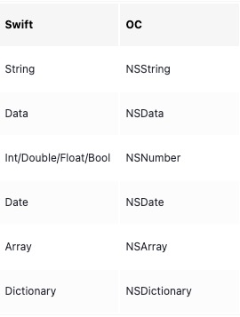

### 持久化手段

- UserDefault
- NSKeyedArchiver 
- JSEncoder
- data.write(to:options:)
- coreData
- Sqlite
- keychain

Demo:

### UserDefault

**目标**：要持久化的对象只能是基本类型或者基本类型为元素的集合。如下图





如果是自定义类型或者自定义类型的元素的集合，是不支持的，但<u>可以通过转换类型为 `Data` 类型后，再保存</u>。

**只适合保存小数据**:对于 UserDefault 保存的对象，实际上是放在沙盒目录**AppData->Library->Preferences**下的一个 plist 文件。其中 key 值就是声明的 key,value 就是保存的数据。由于所有使用UserDefault的内容都保存在那里，而且读取对象的时候需要读取整个 plist 文件，因此只适合保存很小的数据

持久化一个自定义对象

```swift
func useJSONEncoder() {
    let user: User = User(name: "john", age: 18)
    let encoder: JSONEncoder = JSONEncoder()
    if let data = try? encoder.encode(user) {
        UserDefaults.standard.setValue(data, forKey: "user")
        let decoder: JSONDecoder = JSONDecoder()
        if let user2 = try? decoder.decode(User.self, from: data) {
            print(user2.name)
            print(user2.age)
        }
    }
}
```


### NSKeyedArchiver 

有两个作用

- 不使用data.write(to:options:),直接将遵从NSCoding协议的自定义对象归档到文件 【iOS12.0 以上废弃】
- 只是将遵从NSCoding协议自定义对象转换为 `Data`

#### NSCoding 协议

为了使用NSKeyedArchiver持久化或仅仅将对象转为 Data 类型，对象需要遵从 NSCoding 协议，并且实现协议中的两个方法

```swift
func encode(with coder: NSCoder)

required init?(coder: NSCoder)
```

NSCoding协议只能由Class来遵从，而不能由 Struct 遵从。这里实际使用的是NSCoding子类。否则调用归档方法的时候会报错

```swift
class Dog: NSObject, NSSecureCoding {
    var name: String = ""
    var age: String = ""
    
    func encode(with coder: NSCoder) {
        // 即NSKeyedArchiver类型
        coder.encode(name, forKey: "name")
        coder.encode(age, forKey: "age")
    }
    
    
    required init?(coder: NSCoder) {
        if let name = coder.decodeObject(forKey: "name") as? String {
            self.name = name
        }else {
            self.name = ""
        }
        if let age = coder.decodeObject(forKey: "age") as? String {
            self.age = age
        }else {
            self.age = "0"
        }
    }
    
    init(name: String, age: String) {
        self.name = name
        self.age = age
    }
    
    static var supportsSecureCoding: Bool { true }
}
```

#### 直接归档到文件

```swift
    func useNSKeyedArchiverCache() {
//      archiveRootObject(_:toFile:)' was deprecated in iOS 12.0
//      let dog: Dog = Dog(name: "tom", age: 3)
//      NSKeyedArchiver.archiveRootObject(dog, toFile: ##)
    }
```

这个 API 已经在 iOS12 下被废弃，使用的时候会提示要只使用它的转换为 Data 的功能，再使用`data.write(to:options:)`

```swift
'archiveRootObject(_:toFile:)' was deprecated in iOS 12.0: Use +archivedDataWithRootObject:requiringSecureCoding:error: and -writeToURL:options:error: instead
```

#### 转换为 Data

```swift
func useNSKeyedArchiverAndDataCache() {
        let dog: Dog = Dog(name: "tom", age: "3")
        if let data = try? NSKeyedArchiver.archivedData(withRootObject: dog, requiringSecureCoding: true) {
            if let dog = try? NSKeyedUnarchiver.unarchivedObject(ofClass: Dog.self, from: data) {
                print("😄" + "\(dog.age)")
                print("😄" + "\(dog.name)")
            }
        }
    }
```

### JSEncoder


### 选型

- 如果是很小的数据，优选UserDefault，没有必要将这部分数据保存在一个独立的文件。如果这个很小的数据不是基本数据类型或者基本数据类型的集合。优先选择可以通过JSONEncoder而不是NSKeyedArchiver转换为 Data类型,然后使用UserDefault来保存数据

- 如果是比较大的数据，可以使用JSONEncoder转换为 Data类型，然后使用data.write(to:options:) 保存到某个文件

- 如果是很敏感的数据，比如用户账号与密码且不希望用户删掉app 后丢失，将数据保存到钥匙串是比较好的选择。

- 如果数据需要频繁的增删改查，使用 sqlite 或者苹果封装的 coreData 是比较好的选择

